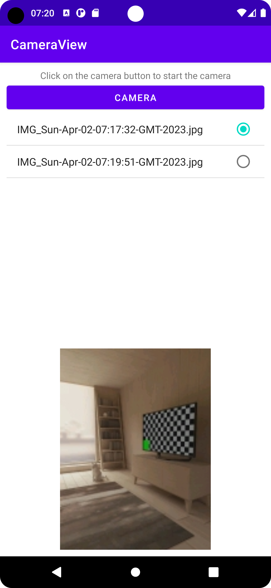

# Using the Camera in Android Apps

Basically, the *old fashioned* camera API is used here. Pictures taken are stored in a directory only accessible within the app.



## How to use the Camera

The Android-API provides a Built-In camera activity to capture a picure.
When the picture is taken, this activity is terminated and returns the photo as Bitmap.

1. Start the built-in Camera Activity
    ```java
    Intent cameraIntent = new Intent(MediaStore.ACTION_IMAGE_CAPTURE);
    activityResultLauncher.launch(cameraIntent);
    ```
2. Fetch and process the image data afterwards: 
    ```java
    activityResultLauncher = registerForActivityResult(new ActivityResultContracts.StartActivityForResult(), 
        new ActivityResultCallback<ActivityResult>() {
            @Override
            public void onActivityResult(ActivityResult result) {
                Bundle extras = result.getData().getExtras();
                Bitmap imageBitmap = (Bitmap) extras.get("data");
                WeakReference<Bitmap> result_1 = new WeakReference<>(Bitmap.createScaledBitmap(imageBitmap,
                            imageBitmap.getWidth(), imageBitmap.getHeight(), false).
                            copy(Bitmap.Config.RGB_565, true));
                Bitmap bm = result_1.get();
                // here, we store the bitmap. see next step
                Uri imageUri = saveImage(bm, MainActivity.this);
                // this is optional
                imageView.setImageURI(imageUri);
            }
        });
    ```
3. Save the image

   Here, we setup a local file storage. A `FileProvider` needs to be declared within the <application> element in the AndroidManifest.xml:
   
   ```xml
   <provider
       android:name="androidx.core.content.FileProvider"
       android:authorities="${applicationId}.fileprovider"
       android:exported="false"
       android:grantUriPermissions="true">
       <meta-data
          android:name="android.support.FILE_PROVIDER_PATHS"
          android:resource="@xml/file_paths" />
   </provider>
   ``` 

   The paths are stored as key-value pairs in the res/xml/file_paths.xml.
   
   ```xml
   <paths xmlns:android="http://schemas.android.com/apk/res/android">
      <files-path name="my_images" path="images/ "/>
      <root-path name="root" path="." />
   </paths>   
   ```
   Finally, we can store the file:
   
   ```java
   private Uri saveImage(Bitmap image, Context context) {
        File imagefolder = new File(context.getFilesDir(), "my_images");
        Uri contentUri = null;
        try {
            imagefolder.mkdirs();
            String fileName = (new Date().toString()+".jpg").replaceAll(" ","-");
            File file = new File(imagefolder, "IMG_"+fileName);
            FileOutputStream stream = new FileOutputStream(file);
            image.compress(Bitmap.CompressFormat.JPEG, 100, stream);
            stream.flush();
            stream.close();
            contentUri = getUriForFile(context,
                    context.getPackageName()+".fileprovider", file);
            pictureFileArrayAdapter.add(new MyPictureFile(file));
        } catch (FileNotFoundException e) {
            e.printStackTrace();
        } catch (IOException e) {
            e.printStackTrace();
        }
        return contentUri;
    }
   ```
   